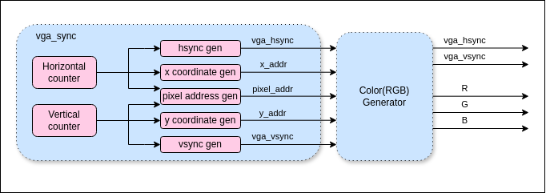
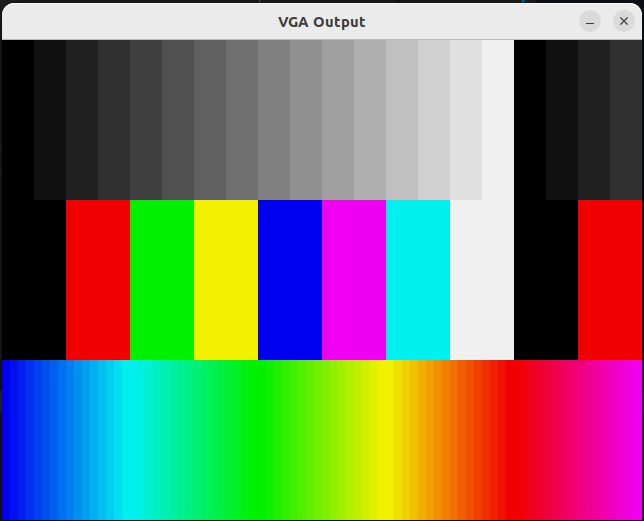

# VGA Controller

## Overview

This project implements a VGA controller using **SystemVerilog**, designed to generate video signals compatible with standard VGA displays. It supports a configurable resolution and timing parameters suitable for simulation and deployment on FPGAs.

## Features

- Standard 640x480 @ 60Hz VGA timing
- Horizontal and vertical sync signal generation
- Active video area tracking
- Pixel coordinates output (`x`, `y`)
- Fully synthesizable
- Modular design for integration into larger systems

## VGA Timing Diagram

```
            |<--------- Active Video -------->|<-- Front Porch -->|<-- Sync Pulse -->|<-- Back Porch -->|
            |---------------------------------|-------------------|------------------|------------------|
             _____________________________________________________                    __________________
H/VSYNC:                                                          |__________________|
```

## Block Diagram



## Repository Structure

## Demo

### Prerequisite

To run the demo program in simulation, you will need to have `cocotb` and `verilator` installed.

### Bar Generation

A small demo program written in verilog is also included in the repo (`demo/bar`). It shows 3 different color bar in the screen.

To run the demo program in simulation:

```shell
cd sim/cocotb
make
```

The simulation runs very slow, it needs about 2~3 minutes for the picture to be fully loaded. Here is the result:




